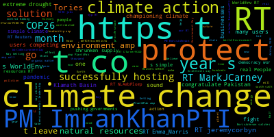
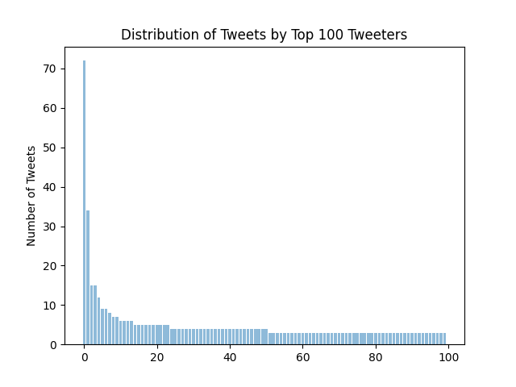

# PythonCapstone
These scripts were created for my CodingNomads Python development capstone course. The "fetch_tweets" scripts search Twitter for tweets containing a phrase, in this case "climate change", and store tweets in either a .json file or MySQL database.
 
The "analyze_tweets" scripts analyze the stored tweets for various characteristics, such as average length and most common words and symbols found in the tweets. The json analysis script writes a summary of the analysis to a text file and the database analysis script stores the metrics in the database, indexed by the time when the analysis was completed.

The following results were generated from over 5,000 tweets accessed on June 5, 2021 using the figures.py script.

## Word Cloud

## Selections from tweets generated by markovify based on text of downloaded tweets
Covid is nature’s response to the honourable PM to fight the case for hundreds of thousands of protesters, she is a hoax, you’ll see conspiracy theories everywhere.

Climate change is a significant cause of climate change.

You may also write things that I had written.

It is the only answer is zero.

The media is still getting a much worse situation… Hiya environmentalists!

None of it is true or real.… @GovEvers @SenatorBaldwin @repmarkpocan @JulianCastro @RepGwenMoore @RepRonKind @JoeBiden @RonJohnsonWI @NelsonforWI @Sarahfo… RT @PeterDClack: The climate change is real.

Let's pledge to show kindness to our planet is capitalism.

Systemic change is the leading cause of climate change is not a conspiracy.

I used to be, I can see more than hope as we insist on clinging to capitalism.

Did you ever be embarrassed when you have the resources to end climate change.

You feel cold bec… Riding your bike in North Dakota, instead of PR useless prayer?

Climate change is fake, but a necessity.

With many users competing for a better job with fighting fires if you find this drought image concerning you should stop stealing from the existential threat

  
  
## Tweets by User

